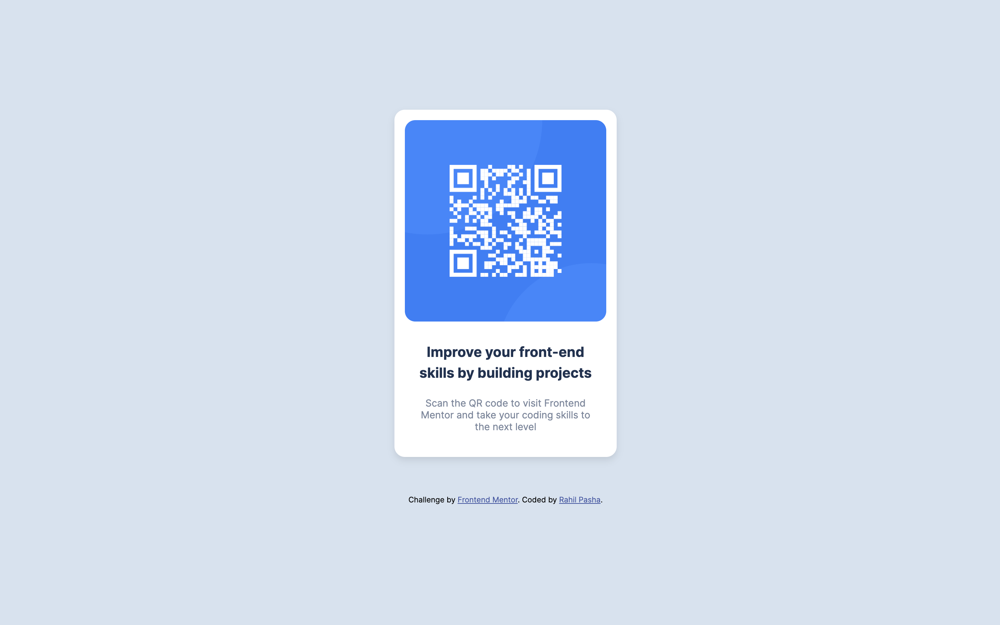
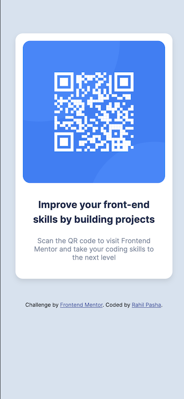

# Frontend Mentor - QR code component solution

This is a solution to the [QR code component challenge on Frontend Mentor](https://www.frontendmentor.io/challenges/qr-code-component-iux_sIO_H). Frontend Mentor challenges help you improve your coding skills by building realistic projects. 

## Table of contents

- [Overview](#overview)
  - [Screenshot](#screenshot)
  - [Links](#links)
- [My process](#my-process)
  - [Built with](#built-with)
  - [What I learned](#what-i-learned)
  - [Useful resources](#useful-resources)
- [Author](#author)
- [Acknowledgments](#acknowledgments)

## Overview

### Screenshots

#### Desktop UI


#### Mobile UI


### Links

- Solution URL: [My Solution URL](https://www.frontendmentor.io/solutions/responsive-qr-code-component-Fk5p8J9G21)
- Live Site URL: [My Live Site URL](https://rahilpasha.github.io/qr-code-component-main/)

## My process

### Built with

- Semantic HTML5 markup
- CSS custom properties
- CSS positioning
- Responsive Media Queries
- Google font library

### What I learned

I learned how to position my HTML elements using CSS with absolute positioning.

```css
.card {

	position: relative;
	top: 150px;
	left: 560px;
	height: 500px;
	width: 320px;
  ...
}
```

I was also able to use a media query to create a responsive design for mobile devises that have a width of 450px or less
```css
@media screen and (max-width: 450px) {
	
	.card {
		top: 60px;
		left: 22.5px;
	}

}
```

### Useful resources

- [CSS-Tricks box-shadow](https://css-tricks.com/almanac/properties/b/box-shadow/) - This helped me make a shadow or hover effect for the main card content.
- [Using Media Queries](https://developer.mozilla.org/en-US/docs/Web/CSS/Media_Queries/Using_media_queries) - This is great article that explains how to use media queries in order to create responsive content based on the size of the display.

## Author

- GitHub - [Rahil Pasha](https://github.com/rahilpasha)
- Frontend Mentor - [@rahilpasha](https://www.frontendmentor.io/profile/rahilpasha)

## Acknowledgments

Inspiration and design came from Frontend Mentor's QR Code Component project.